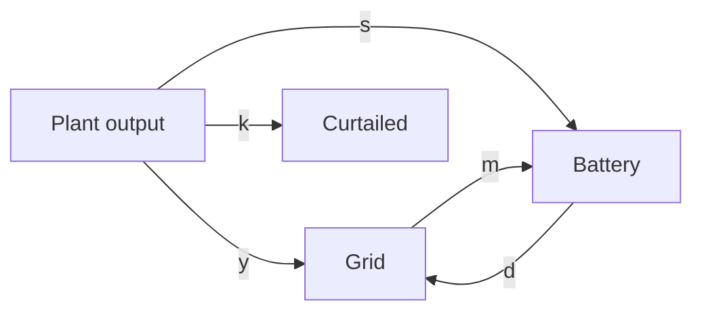

# Concepts

## Time and units

Prices are a series on a regular UTC grid; each timestamp labels the start of its interval
of length $\Delta t$ hours. Power is in MW, energy in MWh and prices in currency per MWh.
Days are UTC days.

## Battery physics

A battery has a power rating $P$ (MW), a rated energy $E_{rated}$ (MWh), charge and
discharge efficiencies $\eta_c, \eta_d$, and a state-of-charge window
$[SOC_{min}, SOC_{max}]$ expressed as fractions of usable energy.

For charge $c_t$ and discharge $d_t$ (MW) in interval $t$, stored energy evolves as

$$E_{t+1} = E_t + \eta_c\, c_t\, \Delta t - \frac{d_t\, \Delta t}{\eta_d}$$

Each interval adds its own throughput to the equivalent full cycle count:

$$N \mathrel{+}= \frac{(c_t + d_t)\,\Delta t}{2 E_{rated}}$$

State of health is computed from lifetime totals, so it never compounds:

$$SOH = 1 - k_{cycle}\, N - k_{calendar}\, \text{age in years}$$

Usable energy is $E_{rated} \cdot SOH$. Ageing is applied at the end of every UTC day,
including days that are not simulated.

## Dispatch

Each day is planned by maximising forecast revenue less an optional degradation cost
$\kappa$ per MWh of throughput:

$$\max \sum_t \hat p_t\, (d_t - c_t)\, \Delta t - \kappa \sum_t (c_t + d_t)\, \Delta t$$

With a carbon price $\lambda$ (currency per tCO2), the planning price becomes
$\hat p_t + \lambda \hat e_t / 1000$ for planned carbon intensity $\hat e_t$ in gCO2/kWh,
so importing is dearer and exporting worth more when the grid is carbon-intensive. Reported
revenue stays at market prices; see [System analysis](guides/system.md#emissions).

subject to the energy balance above for $t = 0 \dots T-1$ with $E_0$ fixed, and:

- $0 \le c_t \le P\, u_t$ and $0 \le d_t \le P\,(1 - u_t)$ with $u_t \in \{0, 1\}$, so the
  battery never charges and discharges at once (an LP would, to burn energy at negative
  prices);
- $SOC_{min}\, E_{usable} \le E_t \le SOC_{max}\, E_{usable}$;
- $E_T \ge E_{target}$, by default the energy the day started with;
- optionally, $\sum_t (c_t + d_t)\, \Delta t \le 2 N_{max}\, E_{usable}$.

The model is solved with [HiGHS](https://highs.dev); a day takes a few milliseconds.

## Backtest timing

For each day $D$:

1. The forecaster receives prices strictly before the decision time, `lead_hours` before
   the start of $D$ (default 12, i.e. noon on $D-1$).
2. The optimiser plans $D$ on the forecast, together with the next `lookahead_days` days
   of forecasts if set (all made at the same decision time); the end-energy target then
   applies at the end of the last planned day.
3. Only $D$'s part of the plan is applied through the battery physics and valued at actual
   prices.
4. The battery state carries into $D+1$, which is planned afresh.

Near the end of the data, or before a gap, the lookahead shortens to the days that can be
forecast. With `lookahead_days: 0` (the default) each day is planned alone and must end
with the energy it started with.

Days with missing prices, or for which the forecaster has no usable history, are skipped
and listed with the reason. Scenarios that are not perfect foresight also run a
perfect-foresight benchmark on the same days.

## Forecasters

| Method | Description |
|--------|-------------|
| `perfect_foresight` | The actual prices; the upper bound. |
| `naive_last_week` | The same interval seven days earlier, falling back to fourteen. |
| `noisy_foresight` | Actual prices plus seeded Gaussian error of a chosen spread. |
| `gradient_boosting` | Gradient-boosted trees on calendar features and 1/2/7/14-day lags (needs the `forecast` extra). |

The gradient-boosting model masks any lag at or after the decision time in exactly the
same way during training and forecasting, and is trained only on a window that ends
before the backtest starts.

## Metrics

| Metric | Definition |
|--------|------------|
| Revenue | $\sum_t p_t\,(d_t - c_t)\,\Delta t$ at actual prices |
| Revenue per MW-year | Revenue $/\,P \times 365\,/$ days simulated |
| Captured spread | Revenue per MWh discharged |
| Equivalent cycles | Lifetime $N$ at the end of the run |
| Forecast MAE / RMSE | Error of the forecast against actual prices |
| Capture ratio | Revenue / perfect-foresight revenue on common days |

## Renewable plants

A plant has a technology, an installed capacity $C$ and an annual degradation rate $r$.
Its available output follows the OPSD capacity factor $cf_t$:

$$g_t = C \cdot cf_t \cdot (1 - r)^{\text{age}}$$

## Captured price

The captured price is what the market paid per MWh the plant actually produced; the
capture rate compares it with the time-weighted (baseload) average:

$$\bar p_{cap} = \frac{\sum_t p_t\, g_t}{\sum_t g_t} \qquad
\text{capture rate} = \frac{\bar p_{cap}}{\frac{1}{T}\sum_t p_t}$$

A capture rate below 100% means the technology tends to produce when prices are low;
falling capture rates as a technology's share grows are known as cannibalisation.
`openenergy capture` reports this per year, together with capacity factor and the share of
output produced at negative prices.

## Co-located sites

A plant and a battery can share one grid connection with an export limit $X$, an import
limit $I$ and an optional premium $\pi$ per MWh of renewable output delivered (ROC- or
CfD-like support).

Each interval, output $G_t = y_t + s_t + k_t$ goes to the grid, to the battery, or is
curtailed; the battery charges $c_t = s_t + m_t$ from the plant and the grid
($m_t \le I$), and net export $x_t = y_t + d_t - m_t \le X$. The daily plan maximises

$$\sum_t \left[\hat p_t\, x_t + \pi\,(y_t + s_t)\right]\Delta t - \kappa \sum_t (c_t + d_t)\,\Delta t$$

with the battery constraints above. Output is curtailed when the price falls below $-\pi$
or the connection is full and the battery cannot absorb it.

Every site run is compared with the same plant and battery on **separate connections**:
the plant exports up to its own capacity and the battery trades on its own. The difference
is the **co-location value**; it is negative when a shared connection is too small, and
should be weighed against the connection capacity saved.

!!! warning "Upper bound"
    Plans use the actual plant output (perfect generation foresight) and forecast prices.
    Co-location results are therefore an upper bound.
